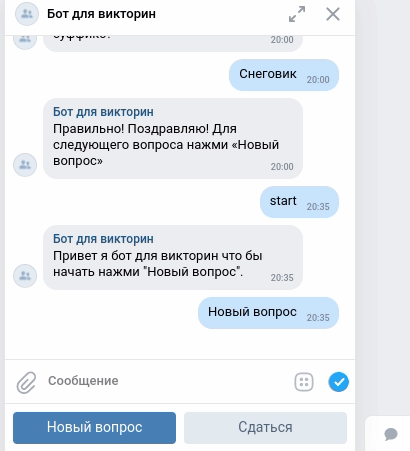

# Боты для проведения викторин в ВКонтакте и Телеграм.

Запускает викторину в основном на культурную и историческую тематику.
Использует две платформы Телеграм `tg_bot.py` [инструкция как создать бота](https://way23.ru/%D1%80%D0%B5%D0%B3%D0%B8%D1%81%D1%82%D1%80%D0%B0%D1%86%D0%B8%D1%8F-%D0%B1%D0%BE%D1%82%D0%B0-%D0%B2-telegram.html)
и ВКонтакте `vk_bot.py` создаете новую группу ВКонтакте, в настройках группы нужно включить "сообщения сообщества".
Также использует виртуальные базы данных [Redis](https://app.redislabs.com/#/login), [инструкция по созданию бд Redis](https://pythonru.com/biblioteki/redis-python)

### Чувствительные данные

Для хранения используем переменные окружения и файл .env

Пример файла .env:

`TG_TOKEN=токен вашего телеграм бота` Можно получить у [@BotFather](https://way23.ru/%D1%80%D0%B5%D0%B3%D0%B8%D1%81%D1%82%D1%80%D0%B0%D1%86%D0%B8%D1%8F-%D0%B1%D0%BE%D1%82%D0%B0-%D0%B2-telegram.html)

`TG_CHAT_ID=ваш чат id` Сюда телеграм бот будет слать уведомления об ошибках

`VK_TOKEN=Токен ВКонтакте` Можно получить в настройках группы "Работа с API"->"Ключи доступа"

`REDIS_HOST=Redis host` можно получить в [личном кабинете](https://app.redislabs.com/#/login) 

`REDIS_PORT=Redis port` можно получить в [личном кабинете](https://app.redislabs.com/#/login)

`REDIS_PASSWORD=Redis password` можно получить в [личном кабинете](https://app.redislabs.com/#/login)

### Дополнительные скрипты

`questions.py` Используется для выбора случайного вопроса из более чем 1000 штук.

### Как установить

Python3 должен быть установлен затем используйте `pip`

```bash
pip install -r requirements.txt
```

### Как запустить

```bash
python vk_bot.py
```
Для начала викторины введите `start`

[Ссылка на бота ВКонтакте](https://vk.com/public212082294)


```bash
python tg_bot.py
```

[Cсылка на бота Телеграм](http://t.me/CaD_quiz_bot)


### Цель проекта

Код написан в образовательных целях на онлайн-курсе для веб-разработчиков [dvmn.org](https://dvmn.org/).